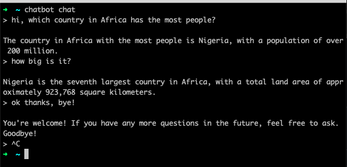

# Chatbot

Type in a message and send it to a LLM to either print or speak the response.

If you like running things from the terminal
and paying for stuff that is otherwise free, then this repo is for you!

## Installation

Don't have Go installed on your machine, but still want to get in on the fun
of giving OpenAI your money? You are in luck.
Head over to the releases page and download a tarball with the binary
that matches your OS.

Unpack the tarbal (`tar -xf chatbot_release.tar.gz`) and move the `chatbot` executable
to somewhere in your system's PATH.
If you're on a mac, your OS will probably warn you not to
trust me by running an executable you found on the internet.
If you know what you're doing you can disable the warning and
start pretending you are chatting with a friend.

## Running the command

Run `chatbot init` to build the config file in `~/.chatbot/config`,
pop your OpenAI token in there,
(and optionally any system instructions for the LLM)
and you can start chatting by running: `chatbot chat`.
Use the `-h` flag to see the general help page or help for a specific command.
For some extra fun, use `chatbot chat -s` (if you're on a mac)
to have the model speak to you.
